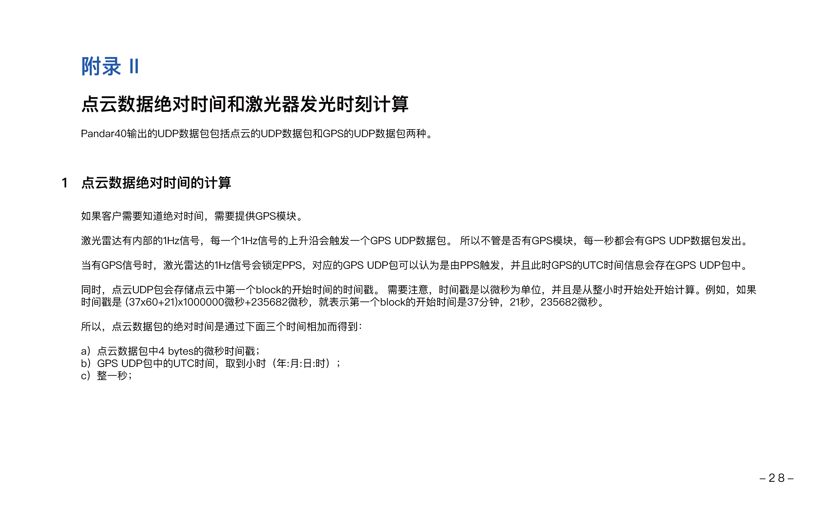

# 禾赛雷达

Pandar40是一款40线机械式激光雷达，其内部包含40组激光收发对，通过360°旋转进行3D成像。

# 控制页面
Husky的Pandar40 的IP为192.168.1.20 ，但目前登不上去
使用在这里直接重写Pandar SDK 和ROS驱动

## 飞行时间测距
激光雷达的测距方式——飞行时间测量法（Time of Flight）
1. 激光雷达中的激光器发射出一束超短激光脉冲；
2. 激光投射到物体上后发生漫反射，激光接收器接收漫反射光；
3. 通过激光光束在空中的飞行时间，准确计算得出目标物体到传感器间的距离。
$$ d =  \frac{1}2 ct$$
d：距离; c ：光速; t ：激光从发出到接收的时间;

点此 <resource src="../resources/Pandar40/Pandar40.pdf" text="下载完整手册"/>下载完整手册。

<chapter title="数据手册" id="details" collapsible="true">

</chapter>
